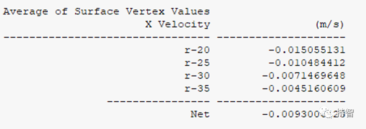

Fluent验证案例：VMFL-01

- *Flow Between Rotating and Srationary Concentric Cylinders [1]*
*(同心圆柱体库艾特流动）*

## 00.案例描述

### Physics/Model

- Lamilar flow, rotating wall

### Test case
>Steady laminar flow between two concentric cylinders is modeled. The flow is induced by rotation of the inner cylinder with a constant angular velocity, while the outer cylinder is held stationary. Due to periodicity only a section of the domain needs to be modeled. In the present simulation a 180° segment (half of the domain shown in Figure .01.1: Flow Domain is modeled. The sketch is not to scale.

### Conditions

Material Properties | Geometry | Boundary Condition
--------------------|----------|-------------------
Density = 1 kg/m3 | Radius of the Inner Cylinder = 17.8 mm | Angular velocity of the inner wall = 1 rad/s
Viscosity = 0.0002 kg/m-s | Radius of the Outer Cylinder = 46.28 mm| **- -  -**

### Analysis Assumptions and Modeling Notes
The flow is steady. The tangential velocity at various sections can be calculated using analytical equations for laminar flow. These values are used for comparison with simulation results.

### Goal

+ 获取特定径向位置上的速度值，与实验值作比较

## 01.二维建模

<!--
-->

## 02.网格划分

## 04.Fluent设置

## 05.计算结果

### 5.1 Results Comparison for ANSYS Fluent

Tangential Velocity at | Target, m/s | Ansys Fluent, m/s | Ratio
----------------------|--------------|------------------|-------
r = 20 mm | 0.0151 | 0.0151 | 1.000 |
r = 25 mm | 0.0105 | 0.0105 | 1.000 |
r = 30 mm | 0.0072 | 0.0072 | 1.000 |
r = 35 mm | 0.0046 | 0.0045 | 0.0978 |
### 5.2 Practical results

- 本文案例（VM-01）获取：https://pan.baidu.com/s/1fT60otapIowD1Y6sPob2Hg
提取码：au69

*参考资料*

>[1]:ANSYS Fluid Dynamics Verification Manual. 2020:9-10.
