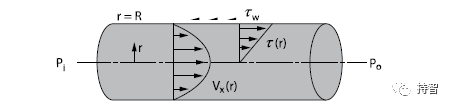
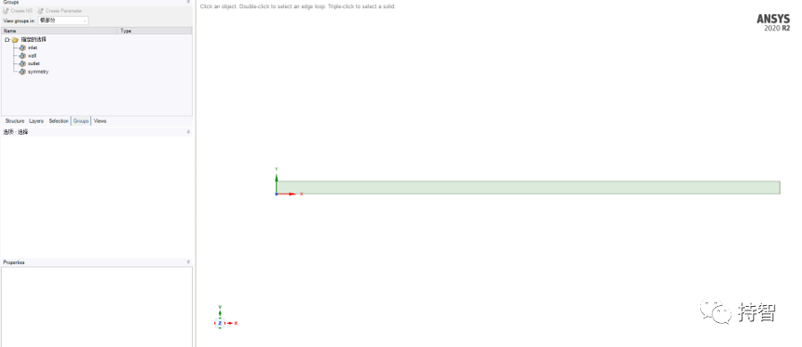
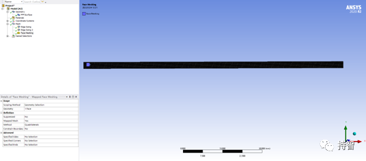
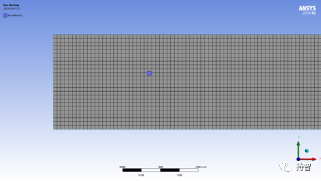
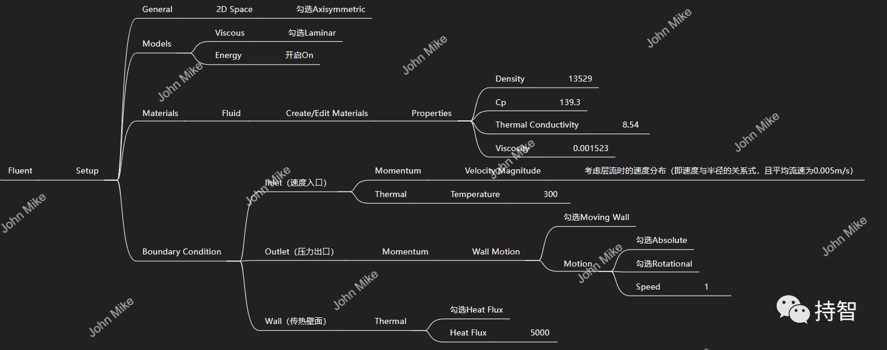
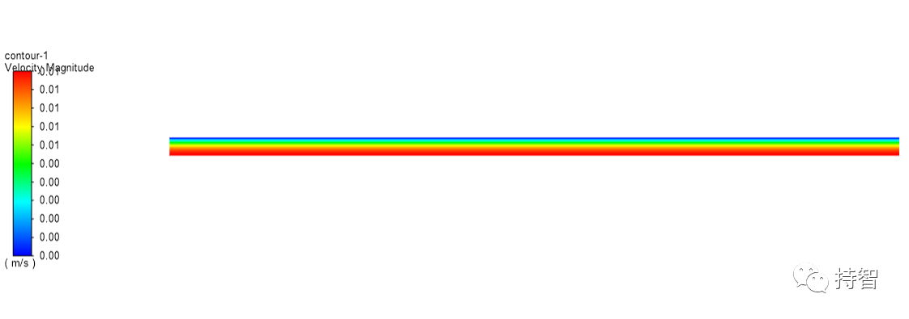
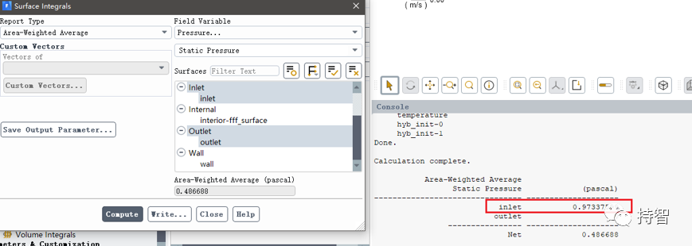
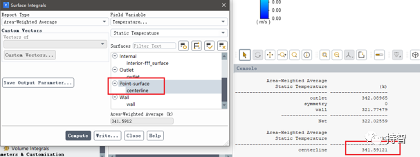

Fluent验证案例：VMFL-02

- *Laminar Flow Through a Pipe with Uniform Heat Flux [1]*
*(通过均匀热通量管道的层流流动）*

## 00.案例描述

### Physics/Model

- Lamilar flow with heat transfer

### Test case
>Laminar flow of Mercury through a circular pipe is modeled, with uniform heat flux across the wall. A fully developed laminar velocity profile is prescribed at the inlet. The resulting pressure drop and exit temperature are compared with analytical calculations for Laminar flow. Only half of the 2–D domain is modeled due to symmetry.

### Conditions

Material Properties | Geometry | Boundary Condition
--------------------|----------|-------------------
Fluid: Mercury | Length of the pipe = 0.1 m | Fully developed velocity profile at inlet.
Density = 13529 kg/m3 | Radius of the pipe = 0.0025 m | Inlet temperature = 300 K
Viscosity = 0.001523 kg/m-s | - | Heat Flux across wall = 5000 W/m2
Specific Heat = 139.3 J/kg-K | - | -
Thermal Conductivity = 8.54 W/m-K | - | -

### Analysis Assumptions and Modeling Notes
The flow is steady and incompressible. Pressure drop can be calculated from the theoretical expression for laminar flow given in Ref. 1[2]. Correlations for temperature calculations are given in Ref. 2[3].

### Goal

+ 获取进出口之间的压降以及出口中心温度大小，与实验值作比较

## 01.二维建模

## 02.网格划分

## 04.Fluent设置

层流时，流体在圆管内充分发展后，管中距轴线距离为r处质点流速为[4]：
$$
u_r = u_{max} \times [1-(\frac {r} {R})^2] = 2 \times u\times [1-(\frac {r} {R})^2]
$$

*注：其中平均流速u=0.005m/s。*

## 05.计算结果

### 5.1 Results Comparison for ANSYS Fluent

|  | Target | Ansys Fluent | Ratio
---------|-----------|------------|-------
Pressure Drop, Pa | 1.000 | 0.999 | 0.999 |
Centerline Temperature at the Outlet | 341.00 | 340.50 | 0.999 |

### 5.2 Practical results

- 本文案例（VM-02）获取：https://pan.baidu.com/s/1MnIYgyn7lA-mDM50KgaTGw 
提取码：lm95 

*参考资料*

>[1] ANSYS Fluid Dynamics Verification Manual. 2020:11-12. 
>[2] F.M.White. Fluid Mechanics . 3rd Edition. McGraw-Hill Book Co., New York, NY. 1994. 
>[3] F.P. Incropera and D.P. DeWitt. Fundamentals of Heat Transfer. John Wiley & Sons. 1981. 
>[4] http://hgyl.wlkc.dlpu.edu.cn/chem3/chem3_1/chem3_1_4.html#step3 "流体流动的内部规律"