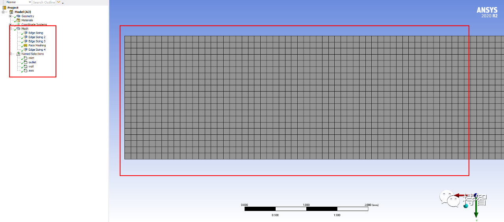

Fluent验证案例：VMFL-03

- *Pressure Drop in Turbulent Flow Through a Pipe [1]*
*(管道中湍流流动压降）*

## 00.案例描述

### Physics/Model

- Turbulent flow, standard k-ε Model

### Test case
>Air flows through a horizontal pipe with smooth walls. The flow Reynolds number is 1.37 X 104. Only half of the axisymmetrical domain is modeled.

### Conditions

Material Properties | Geometry | Boundary Condition
--------------------|----------|-------------------
Density = 1.225 kg/m3 | Length of the pipe = 2 m | Inlet velocity = 50 m/s 
Viscosity = 1.7894 $\times$ 10-5 kg/m-s | Radius of the pipe = 0.002 m | Outlet pressure = 0 pa 

### Analysis Assumptions and Modeling Notes
The flow is steady. Pressure drop can be calculated from analytical formula using friction factor f which can be determined for the given Reynolds number from Moody chart. The calculated pressure drop is compared with the simulation results (pressure difference between inlet and outlet).

### Goal

+ 获得管内流动为湍流时的一个进出口压降值，与实验值作比较

## 01.二维建模

## 02.网格划分

## 04.Fluent设置

需要说明的一点是层流时，流体在圆管内充分发展后，管中距轴线距离为r处质点流速为[4]：

$$
u_r = 2 \times u\times [1-(\frac r R)^2] \tag{1-1}
$$

*注：其中u为平均流速。*

而湍流时的速度分布由实验测定，其分布方程通常表示成以下形式：

$$
u = u_{max} \times (1-\frac r R)^n \tag{1-2}   
$$

$$
4 \times 10^4 < Re < 1.1 \times 10^5,  n = \frac 1 6
$$
$$
1.1 \times 10^5 < Re < 3.2 \times 10^6,  n = \frac 1 7
$$
$$
Re > 3.2 \times 10^6,  n = \frac 1 {10}
$$

由于$Re = 1.37 \times 10^4<4 \times 10^4$ ，即不适用以上公式（无法确定$n$的值），因而选择了式（1-1）作为替代。  

## 05.计算结果

### 5.1 Results Comparison for ANSYS Fluent

|  | Target | Ansys Fluent | Ratio
---------|-----------|:------------:|-------
Pressure Drop, Pa | 21744 | 21480 | 0.988 |

### 5.2 Practical results

- 本文案例（VM-03）获取：https://pan.baidu.com/s/1qzlXKy6BWHrRnYqkvqJQcQ 
提取码：m5ne 

*参考资料*

>[1] ANSYS Fluid Dynamics Verification Manual. 2020:13-14.