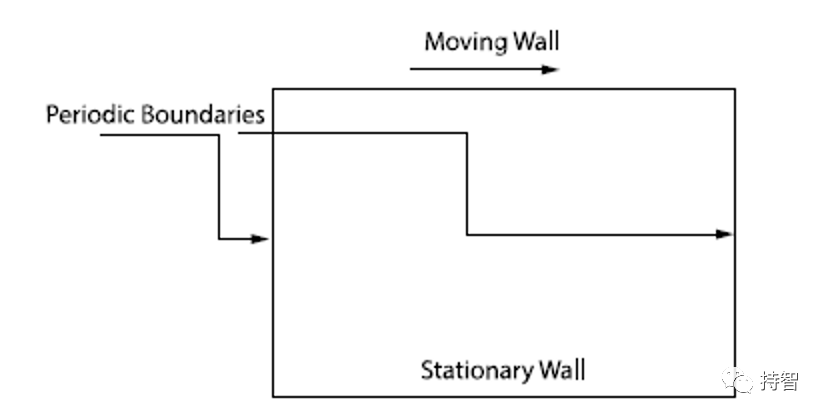
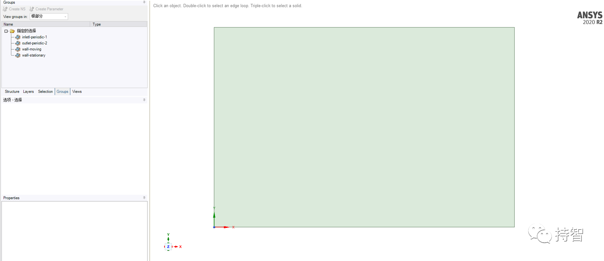
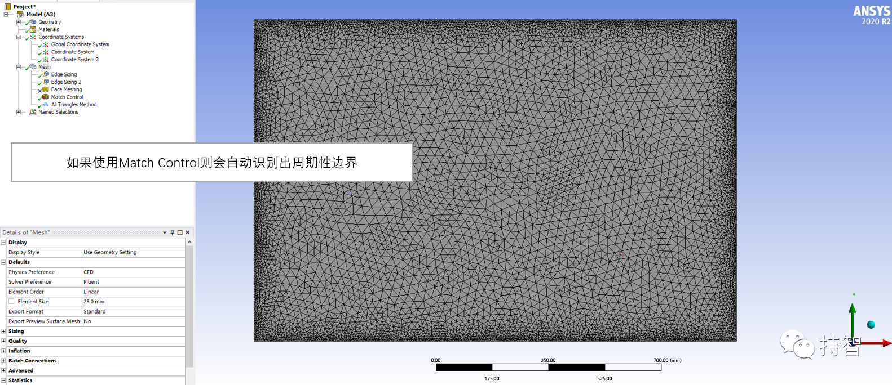
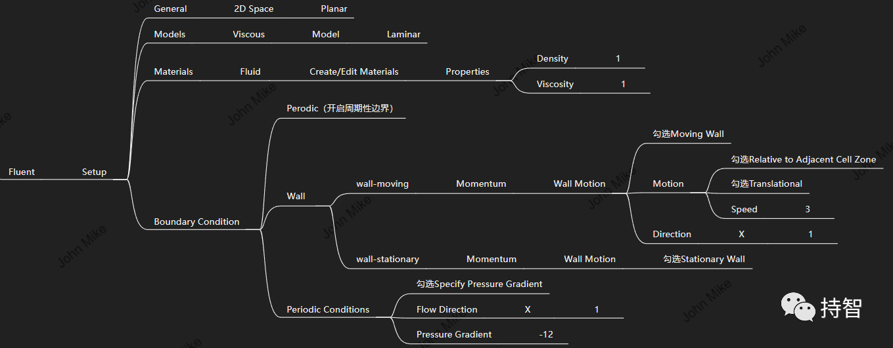
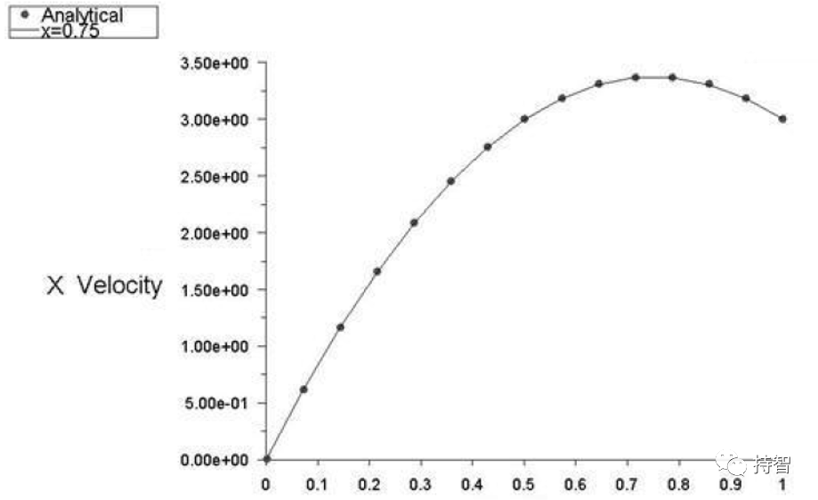
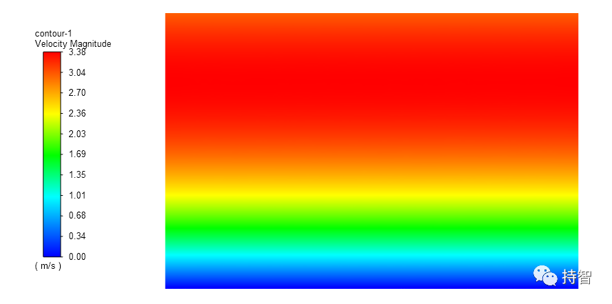
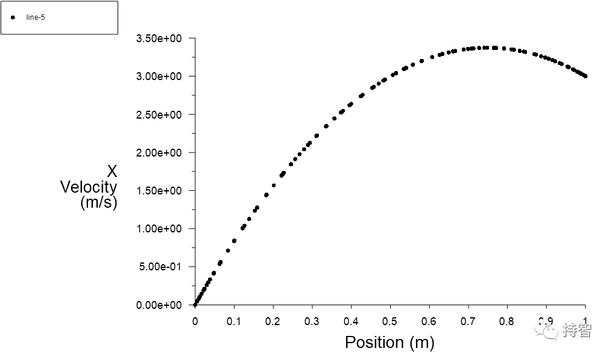
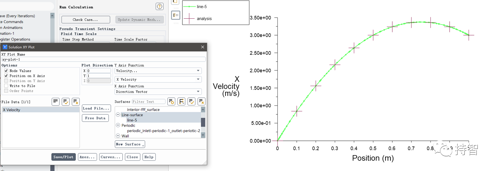

Fluent验证案例：VMFL-04

- *Plain Couette Flow with Pressure Gradient [1]*
*(压力梯度下的平面库艾特流动）*

## 00.案例描述

### Physics/Model

- Laminar flow, moving wall, periodic boundaries

### Test case
>Viscous flow between two parallel plates is modeled. The top plate moves with a uniform velocity while the lower plate is fixed. A pressure gradient is imposed in a direction parallel to the plates.

### Conditions

Material Properties | Geometry | Boundary Condition
--------------------|----------|-------------------
Density = 1 kg/m3 | Length of the pipe = 1.5 m | Velocity of the moving wall = 3 m/s in X-direction
Viscosity = 1 kg/m-s | Width of the domain = 1 m | Pressure gradient across periodic boundaries = -12 Pa/m

### Analysis Assumptions and Modeling Notes
The flow is steady and laminar. Periodic conditions with specified pressure drop are applied across the flux boundaries.

### Goal

+ 获得在X=0.75 m横截面处的X方向的速度分布，与实验值作比较

## 01.二维建模

## 02.网格划分

## 04.Fluent设置

**如何根据周期性要求划分网格？**

方法1：指定线节点数目的时候，两条周期性边界的边的节点要严格保持一致（将Soft改为Hard），选择Face Meshing；在设参时需人为开打开周期性边界命令；

方法2：指定完线的节点数目后，插入一个Method(四面体网格)，选择Match Control，（为High和Low）设置两个坐标，会自动识别周期性边界。

**如何开启周期性边界？**

方法1：TUI命令：mesh/modify-zones/make-periodic；

方法2：直接选择两个（或多个）边（周期性边界），右击鼠标选择periodic。

## 05.计算结果

### 5.1 Results Comparison for ANSYS Fluent

### 5.2 Practical results

提示：可以使用getdata软件对图中的数据点进行坐标值的提取，便于后处理对比解析解。

- 本文案例（VM-04）获取：https://pan.baidu.com/s/1YlDBIlL0-JDNkbkiBp1jgw 
提取码：jfg4 

*参考资料*

>[1] ANSYS Fluid Dynamics Verification Manual. 2020:15-17.