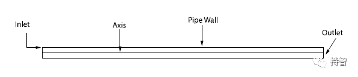
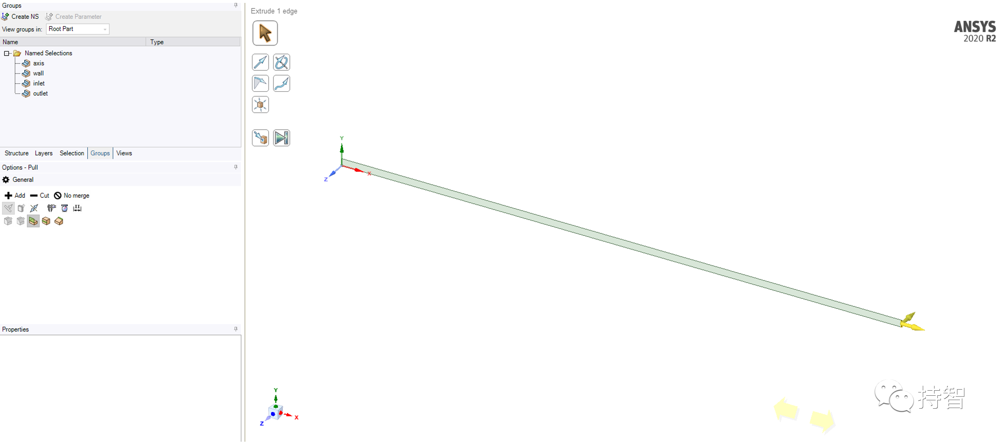
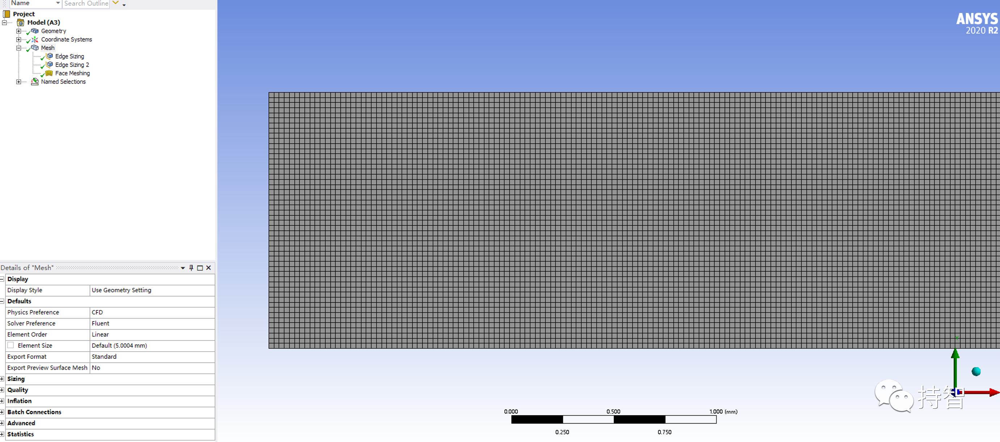
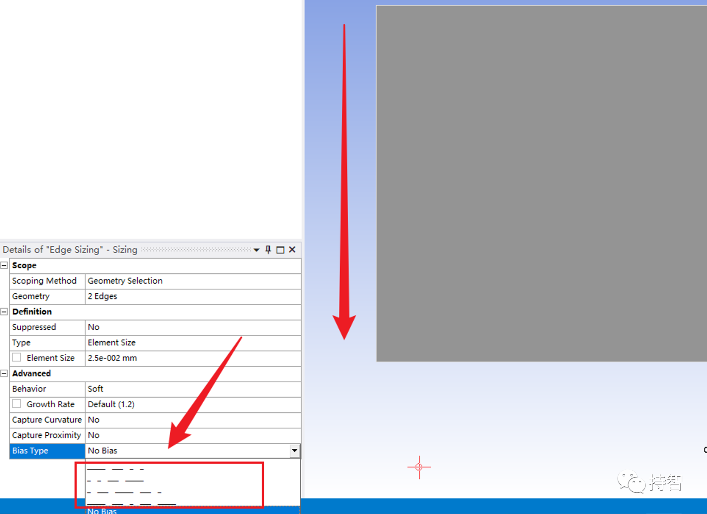
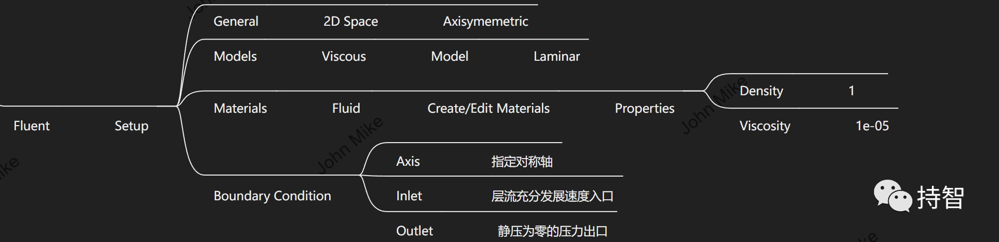
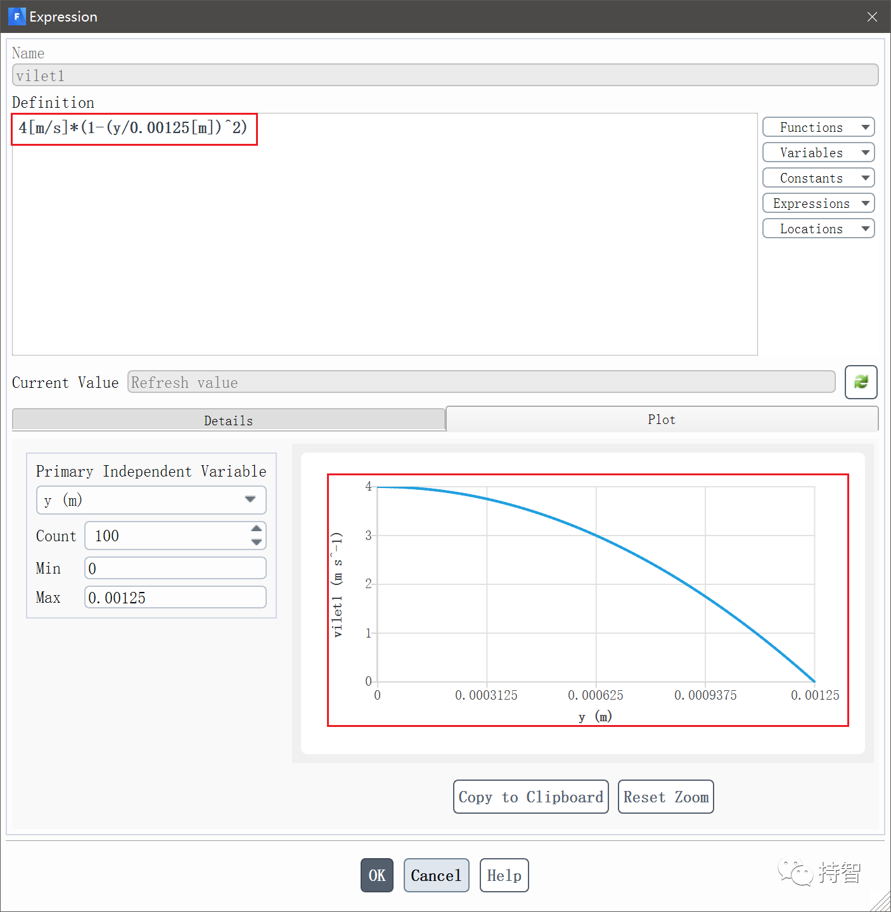
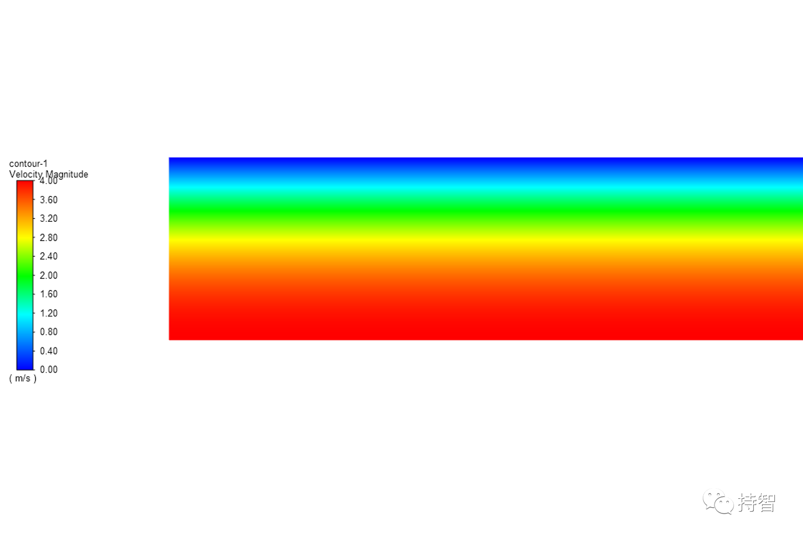
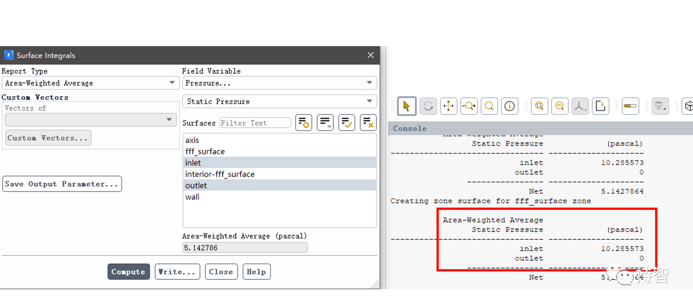

Fluent验证案例：VMFL-05

- *Poiseuille Flow in a Pipe[1]*.
*(直管中的泊肃叶定律）*

## 00.案例描述

### Physics/Model

- Steady laminar flow

### Test case
>Fully developed laminar flow in a circular tube is modeled. Reynolds number based on the tube diameter
is 500. Only half of the axisymmetric domain is modeled.

### Conditions

Material Properties | Geometry | Boundary Condition
--------------------|----------|-------------------
Density = 1 kg/m3 | Length of the pipe =1.5 m | Fully developed laminar velocity profile at inlet with an average velocity of 2.00 m/s
Viscosity =1e-5 kg/m-s | Radius of the pipe =0.00125 m | 

### Analysis Assumptions and Modeling Notes
The flow is steady. A fully developed laminar velocity profile is prescribed at the inlet. Hagen-Poiseuille equation is used to determine the pressure drop analytically.

### Goal

+ 获取直管层流流动时进出口压降值，与解析值进行比较

## 01.二维建模

## 02.网格划分

如果还需要调整一下网格的分布（沿着径向方向的疏密程度），可以采取如下操作：

## 04.Fluent设置

***注意***：对于入口速度，定义为充分发展的层流流动速度分布($\overline{V}=2m/s$)。

## 05.计算结果

### 5.1 Results Comparison for ANSYS Fluent

  | Target | Target |ANSYS Fluent | Ratio
  :-------:|:-------------:|:---------:|:----:
  Pressure | 10.24  | 10.22 | 0.998

### 5.2 Practical results

- 本文案例（VM-05）获取：https://pan.baidu.com/s/1kAgk5VmF2bZbd_kNZsljzQ 
提取码：qq28

*参考资料*

>[1] ANSYS Fluid Dynamics Verification Manual. 2020:19-20.