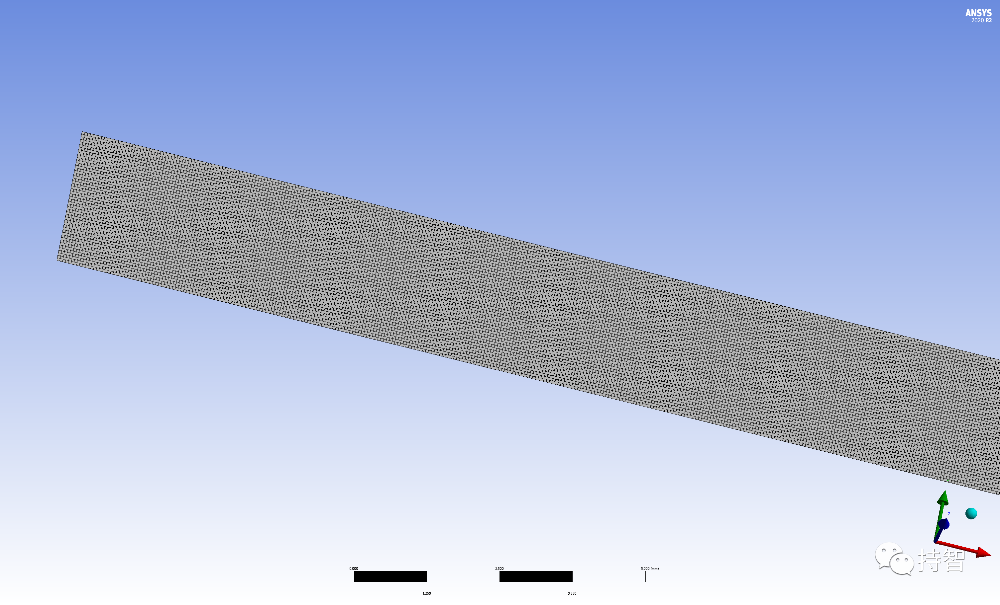

Fluent验证案例：VMFL-06

- *Multicomponent Species Transport in Pipe Flow[1]*.
*(管内的多组分流动）*

## 00.案例描述

### Physics/Model

- Steady laminar flow, species transport

### Test case
>Fully developed laminar flow in a circular tube, with two species is modeled. Species A enters at the inlet and species B enters from the wall. Uniform and dissimilar mass fractions are specified at the pipe inlet and wall. Fluid properties are assumed to be the same for both species, so that computed results can be compared with analytical solution.

### Conditions

<!--

Material Properties | Geometry | Boundary Condition
--------------------|----------|-------------------
**Species A** | Lenth of the pipe = 0.1 m | Fully developed laminar velocity profile at inlet with an average velocity of 1 m/s
Density = 1 kg/m3 | Radius of the pipe = 0.0025 m | Mass fraction of species A at pipe inlet = 1
Viscosity =1.0$\times10^{-5}$ Pa-s |  | Mass fraction of species B at pipe inlet = 0
DiffusivityBA = $1.43\times10^{-5}$ m2/s | | Mass fraction of species A at pipe wall = 0
**Species B** |  | Mass fraction of species B at pipe wall = 1
Density = 1 kg/m3 |  | 
Viscosity = $1.0\times10^{-5}$ Pa-s | 
DiffusivityBA = $1.43\times10^{-5}$ m2/s | |

-->

***注意***：单位转换(与Fluent设参保持一致)：
- 动力粘度单位：$1cP(厘泊)=0.01P(泊)=1mPa·s=0.001Pa·s=1kg/(m·s)$
- 运动粘度单位：$1cSt(厘斯)=0.01St(斯)=1mm^2/s=0.000001m^2/s=0.0036m^2/h$

### Analysis Assumptions and Modeling Notes
The flow is steady. A fully developed laminar velocity profile is prescribed at the inlet. Species transport model is used.

### Goal

+ 获取直管层流流动时在X位置处组分A的浓度大小，与目标值进行比较

## 01.二维建模

## 02.网格划分

## 04.Fluent设置

***注意***：对于入口速度，定义为充分发展的层流流动速度分布($\overline{V}=1m/s$)。

## 05.计算结果

### 5.1 Results Comparison for ANSYS Fluent

  | Axial location(m) | Target |ANSYS Fluent | Ratio
  :-------:|:-------------:|:---------:|:----:
  0.01 | 0.8225 | 0.8223 | 1.000
  0.02 | 0.7308 | 0.7307 | 1.000
  0.03 | 0.6593 | 0.6292 | 1.000
  0.04 | 0.5992 | 0.5991 | 1.000
  0.05 | 0.5469 | 0.5469 | 1.000
  0.06 | 0.5006 | 0.5006 | 1.000
  0.07 | 0.4589 | 0.4591 | 1.000
  0.08 | 0.4212 | 0.4214 | 1.000
  0.09 | 0.3869 | 0.3871 | 1.001
  0.10 | 0.3555 | 0.3558 | 1.001
  
Comparison of Mass Fraction of Species A Along the Axis

### 5.2 Practical results

- 本文案例（VM-06）获取：https://pan.baidu.com/s/1OWmA_FQtxZEs9PG37GPFnQ 提取码：j9a3 

*参考资料*

>[1] ANSYS Fluid Dynamics Verification Manual. 2020:21-22.