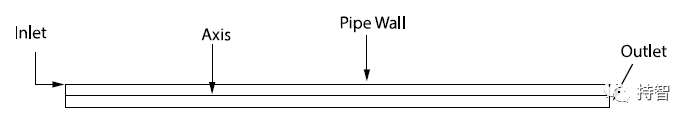
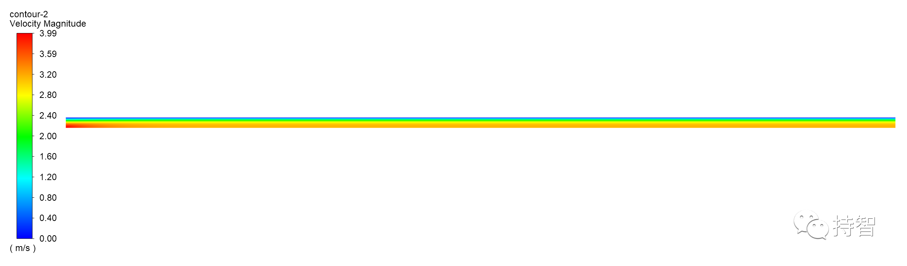
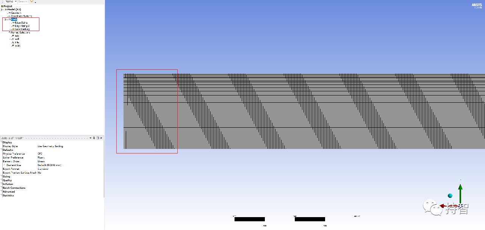
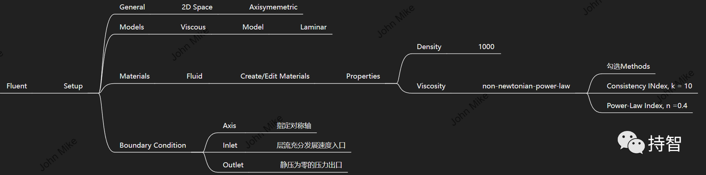
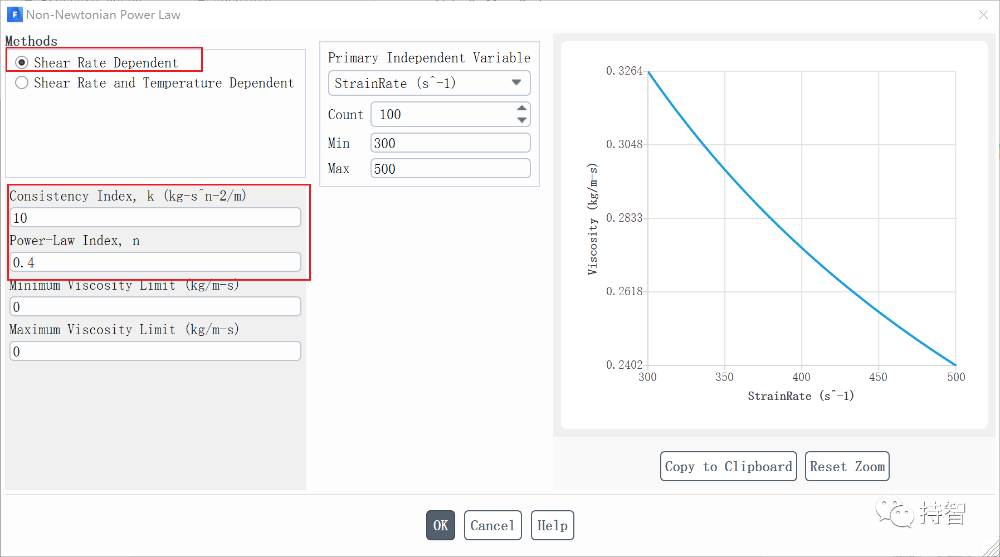
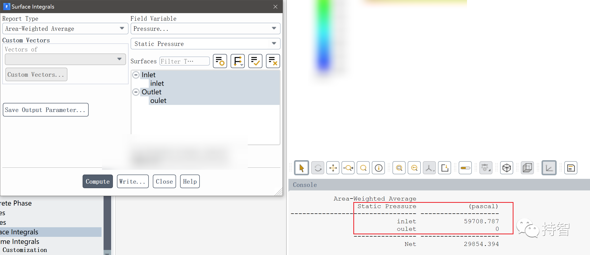

Fluent验证案例：VMFL-07

- *Non-Newtonian Flow in a Pipe[1]*.
*(管道内非牛顿流体流动）*

---

**目录**
[TOC]

---

## 00.案例描述

### Physics/Model

- Steady laminar flow, power law for viscosity

### Test case
>Flow of a non-Newtonian fluid in a circular pipe is modeled. Viscosity is specified by power law equation.

### Conditions

Material Properties | Geometry | Boundary Condition
--------------------|----------|-------------------
Density = 1000 kg/m3 | Lenth of the pipe = 0.1 m | Fully developed velocity profile at inlet with an average velocity of 2 m/s
Viscosity: Power law | Pipe diameter = 0.0025 m | 
Parameter: k=10 n= 0.4 |  | 

### Analysis Assumptions and Modeling Notes
The flow is steady. Viscosity is specified using non-Newtonian power law equation.

### Goal

+ 观测直管进出口压降值，与目标值进行比较

## 01.二维建模

## 02.网格划分

## 04.Fluent设置

## 05.计算结果

### 5.1 Results Comparison for ANSYS Fluent

  |  | Target |ANSYS Fluent | Ratio |
  | :-------:|:-------------:|:---------:|:----:|
  | Pressure Drop, kPa | 60.52 | 60.41 | 0.998 |

### 5.2 Practical results

- 本文案例（VM-07）获取：https://pan.baidu.com/s/1hfqsty-Ycn6NSKj5N7VzaA 提取码：t2c0 

## 07.补充
What is Strain Rate(应变速率)?[2-3]

- Strain rate is a measure of how quickly a component or material is being deformed. Its units are strain per unit time, but since strain is a unitless values, strain rate typically has units of 1/s.(单位时间内的应变改变量)

*参考资料*

>[1] ANSYS Fluid Dynamics Verification Manual. 2020:23-24. 
>[2] https://standardmechanics.com/strain-rate/ 
>[3] https://baike.baidu.com/item/%E5%BA%94%E5%8F%98%E9%80%9F%E7%8E%87/407486 