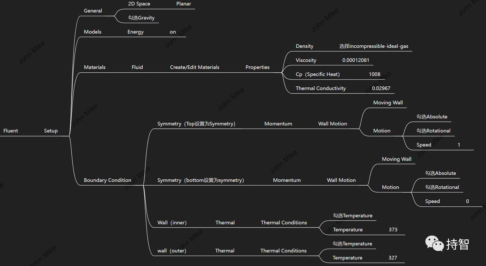
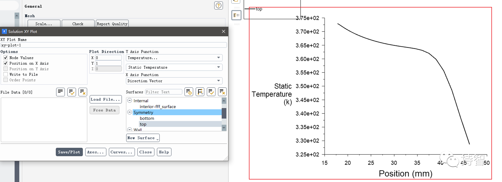

Fluent验证案例：VMFL-09

- *Natural Convection in a Concentric Annulus[1]*.
*(同心管内自然对流）*

## 00.案例描述

### Physics/Model

- Heat transfer, natural convection, laminar flow

### Test case

> Flow in a cylindrical cavity enclosed with a lid that spins at Ω = 1.0 rad/s. The flow field is 2–D axisymmetric, so only the region bounded by the dashed lines in Figure .08.1: Flow Domain (p. 25)needs to be modeled. The Reynolds number of the flow based on the cavity radius R and the tip-speed of the disk is 1800.

### Conditions

| Material Properties | Geometry | Boundary Condition |
| :--------------------: |:----------:|:-------------------:|
| Density = 1 kg/m 3 | Height of the cavity = 1 m | Speed of rotation of the moving wall = 1 rad/s |
| Viscosity: 0.000556 kg/m-s | Radius of cavity = 1 m | Rotational velocity for cell zone = -1 rad/s |

### Analysis Assumptions and Modeling Notes

- The flow is symmetric and only half of the domain is modeled. Density is calculated based on incompressible ideal gas assumption. The flow is laminar.

### Goal

+ 观测底部与顶部的温度分布，与目标值进行比较

## 01.二维建模

## 02.网格划分

## 04.Fluent设置

## 05.计算结果

### 5.1 Results Comparison

### 5.2 Practical results

本文案例（VM-09）获取：https://pan.baidu.com/s/1DNixhY4d5FhoUsfqVm4Rlw 提取码：wft2 

**参考资料**

*[1] ANSYS Fluid Dynamics Verification Manual. 2020:29-32.* 

